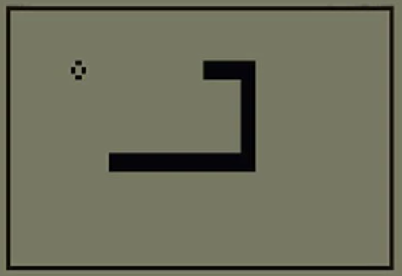

# Snake Game

## Introduction

Classic snake game, in which the player grab food using arrow keys.
Every food grabed, increase snake lenght.

Enhacements:
  * track/save highscore, which is stored data.txt

## Controls
Arrow Keys:
* Up 
* Down
* Left
* Right
* q key to exit

## Dependencies

| File      | Description |
| ----------- | ----------- |
| snake.py      | Generates the snake and move functions.       |
| food.py       | Generates snake food |
| scoreboard.py    | Display the score and highscore.        |
| data.txt | Store the highest score. |

