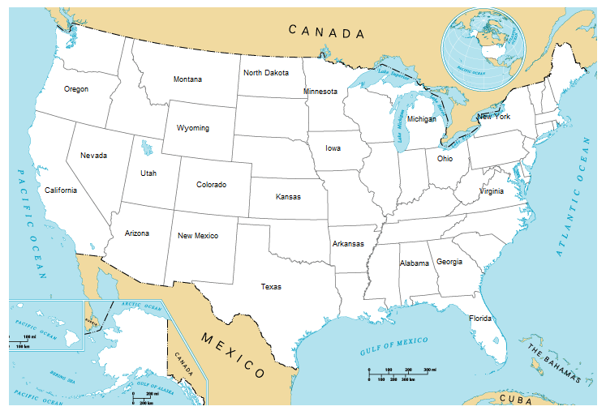

# Guess the US States

## Introduction

In this game you need to guess and write correctly all US states you remember.

Type Exit to end the program, then a file is created (missing_states.csv) with the missing US states.

## Dependencies

| File      | Description |
| ----------- | ----------- |
| main.py       | main program file |
| 50_states.csv      | table with states and its coordinates for location in the map       |
| missing_states.csv  | missing states will be saved here        |

