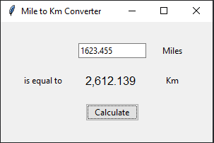

# Miles to Km Converter, Tkinter GUI

## Introduction

Miles to Kilometres Converter, if the input is not decimal/number, will drop an error message once you hit "Calculate" button.

## Dependencies

| File      | Description |
| ----------- | ----------- |
| main.py       | main program file |

