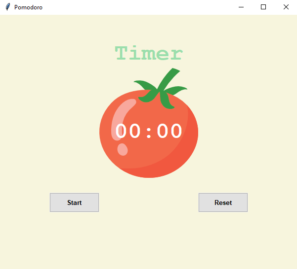

# Pomodoro, Tkinter GUI

## Introduction

The objective of this GUI is to help user to study/work using pomodoro technique.

you need to modify following variables to set the time for work, break and long break;
recommended values are 25 for work, 5 for short break and 20 for long break
|Variables|
|---------|
|WORK_MIN|
|SHORT_BREAK_MIN|
|LONG_BREAK_MIN |

Sounds were added to mark the beggining of each phase

After long break, a pomodoro cicle finish and the GUI is reset.

## Dependencies

| File      | Description |
| ----------- | ----------- |
| main.py       | main program file |

