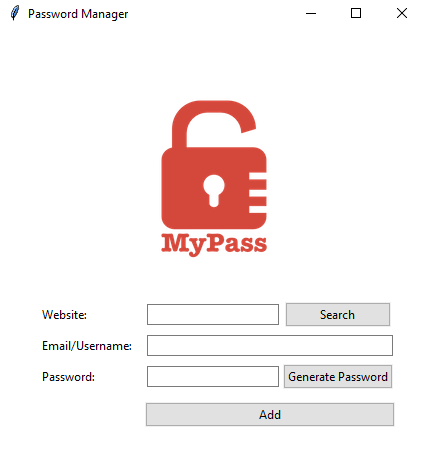

# Password Manager, Tkinter GUI

## Introduction

This GUI will help you to save websites password in a file,
you can either type a password or generate it.

New version: 

   * Search button added
   * Ask for override if website already exist
   * Instead of save data as .txt, we use a json file.

## Dependencies

| File      | Description |
| ----------- | ----------- |
| main.py       | main program file |
| data.txt     | passwrd file |

